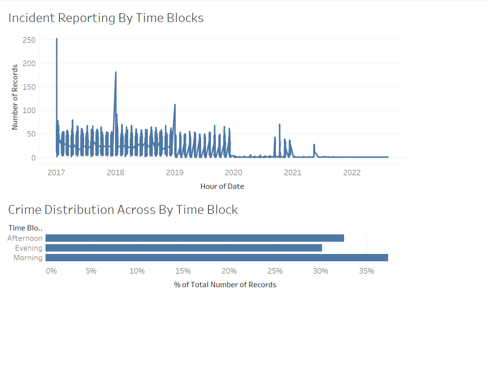
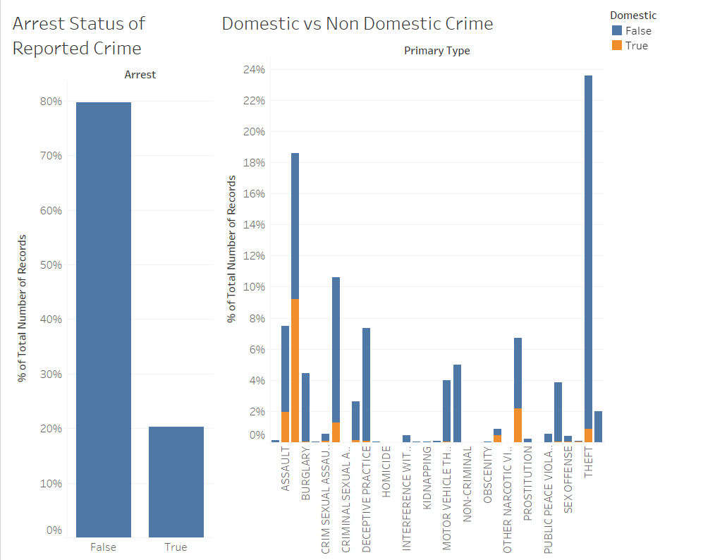

# Crime-Analysis
## Tableau Training
### Course-End Project Problem Statement
Problem Scenario: Crime analysis is important for law-and-order maintenance at any place. It helps the police department and law enforcement agencies to identify patterns of crime, which is crucial for the effective planning of a crime prevention program. The purpose of crime data analysis is to support the operations of the police department, like a criminal investigation, apprehension, prosecution, and development of crime prevention and reduction strategies.

Problem objective: As a data scientist, you should prepare a dashboard to keep the police department and the city updated on the statistics of crime events. You are required to create a dashboard/story using tableau for the communication website. Pay attention to data storytelling.

Note: Download Crime data from the course resource section in the LMS. 

Variable Description: 

ID: A unique identifier for each record.

Case Number: The police department's case number, which is unique to each incident.

Date: The date when the incident occurred. Please note that this may sometimes be an estimate.

Block: A partially redacted address that provides the general location of the incident (usually on the same block as the actual address).

UCR (Uniform Crime Reporting) Code: A code that is directly linked to the Primary Type and Description, providing standardized classification.

Primary Type: A primary description of the incident based on the UCR code.

Description: A secondary description of the incident, offering further details and subcategories of the primary description.

Location Description: A description of the location where the incident occurred.

Arrest: Indicates whether an arrest was made in connection with the incident.

Domestic: Indicates whether the incident involved domestic issues.

Beat: Represents the specific beat or police geographic area where the incident took place. Beats are the smallest police divisions.

District: Indicates the police district where the incident occurred.

Ward: Represents the ward, which corresponds to the city council district, where the incident occurred.

Community Area: Indicates the community area where the incident took place.

NIC (National Incident Code) Code: A code used to classify crimes nationally.

X Coordinate: Provides the x-coordinate of the location where the incident occurred, typically in state plane coordinates.

Y Coordinate: Provides the y-coordinate of the location where the incident occurred, typically in state plane coordinates.

Year: The year when the incident occurred.

Updated On: The date and time when the record was last updated.

Latitude: The latitude of the location where the incident occurred.

Longitude: The longitude of the location where the incident occurred.

Location: A location description in a format that enables mapping and geographic operations on this data portal.

Steps to perform:
###	Overall Crime Statistics Dashboard:
1.	For personnel and resource management, the department needs to understand the count and types of crimes reported across the city. Mark the locations on a geo-map highlighting the locations with recent criminal history.
2.	Identify the most common criminal incidents reported.     
3.	In this introductory dashboard, include a live crime feed to exhibit the total number of crimes reported to date for the current year and the most recently reported crime with their time and locations.

###	Time Period Analysis Dashboard:
Along with locations, the study of crime statistics across time statistics is also crucial for understanding the patterns and planning those preventive strategies. 
a.	Study distribution count of crime incidents across different time periods such as day of the week or hour.
b.	Further explore the percentage of incident reporting for several time blocks (afternoon, evening, early morning, etc.).

###	Trend Analysis Dashboard:
1.	Create a dashboard to study the change in crime rate over different years. 
2.	Compare the change in the incident reporting over the years for the same date and time.

###	Comparative Analysis:
1.	Study the distribution of incidents reported where an arrest was made vs. not.
2.	Identify what percentage of the reported incidents under each incident category are domestic.

###	 To make the dashboard interactive, provide filters for incident type and location in these dashboards for a granular study.

# DASHBOARDS

